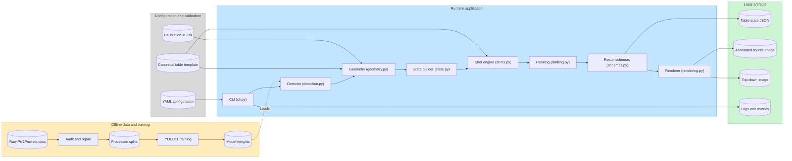

# Workflow and Technical Architecture

This document visualizes the approved MVP described in `TECHNICAL_PLAN.md`. The diagrams use Mermaid and render directly on GitHub and in other Mermaid-compatible Markdown viewers.

## End-to-end workflow

```mermaid
flowchart LR
    imageInput[/Single input image/]

    subgraph vision ["Vision and geometry"]
        validate[Validate and letterbox]
        detector[YOLO11 detection]
        postprocess[Filter duplicates and outliers]
        dotsReady{Enough rail dots?}
        railFit[Fit four rail lines]
        geometryOk{Geometry valid?}
        manual[Manual corner calibration]
        homography[Estimate homography]
        project[Project ball centres]
    end

    subgraph analysis ["Shot analysis"]
        tableState[(Normalized table state)]
        legalTargets[Resolve legal targets]
        generateShots[Generate direct shots]
        pathsClear{Paths clear?}
        rejectShot[Reject candidate]
        rankShots[Rank feasible shots]
    end

    resultOutput[\Annotated images and JSON/]

    imageInput --> validate
    validate --> detector
    detector --> postprocess
    postprocess --> dotsReady
    dotsReady -->|"Yes"| railFit
    dotsReady -->|"No"| manual
    railFit --> geometryOk
    geometryOk -->|"Yes"| homography
    geometryOk -->|"No"| manual
    manual --> homography
    homography --> project
    project --> tableState
    tableState --> legalTargets
    legalTargets --> generateShots
    generateShots --> pathsClear
    pathsClear -->|"No"| rejectShot
    rejectShot -.->|"Next pair"| generateShots
    pathsClear -->|"Yes"| rankShots
    rankShots --> resultOutput

    style vision fill:#C2E5FF,stroke:#3DADFF
    style analysis fill:#DCCCFF,stroke:#874FFF
    style dotsReady fill:#FFECBD,stroke:#FFC943
    style geometryOk fill:#FFECBD,stroke:#FFC943
    style rejectShot fill:#FFCDC2,stroke:#FF7556
    style rankShots fill:#CDF4D3,stroke:#66D575
```



### Workflow interpretation

- Automatic geometry is attempted first using rail-dot detections.
- Low-confidence or invalid geometry switches to manual four-corner calibration.
- Every ball is transformed into the same normalized 2:1 table.
- The shot engine enumerates legal object-ball and pocket pairs, rejects obstructed paths, and ranks the remaining candidates.
- The final result contains both human-readable overlays and machine-readable state.

## Technical architecture



### Architectural boundaries

| Boundary | Responsibility |
|---|---|
| Offline data and training | Validate labels, produce leakage-aware splits, train YOLO11, and publish a selected local checkpoint |
| Runtime application | Turn one input image into detections, geometry, normalized state, ranked shots, and visual output |
| Configuration and calibration | Keep model thresholds, ranking weights, canonical geometry, and manual fallback data outside source code |
| Local artifacts | Preserve structured results, visual diagnostics, and run metrics for evaluation and debugging |

### Core contracts

The modules should exchange typed objects rather than unstructured dictionaries:

```text
DetectionResult
    -> GeometryResult
    -> TableState
    -> ShotCandidate[]
    -> RankedShot[]
    -> AnalysisResult
```

Each result should carry confidence values and warnings so later stages can reject unsafe assumptions instead of silently producing a shot.

