# 🎱 8-Ball Pool Ball and Rail-Sight Detection

**A YOLO11 detector for broadcast 8-ball pool frames. It finds every ball and the rail diamonds, then reconstructs the four table rails from the diamonds alone.**

   

<p align="center">
  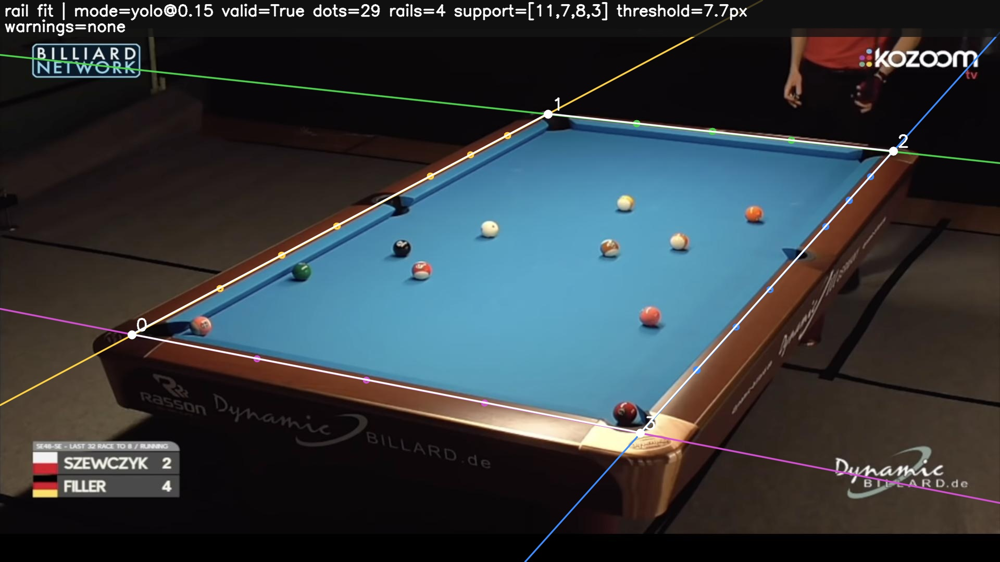
</p>

## 🚀 Summary

- **One model, five classes:** Black, Cue, Solid and Striped balls, plus the rail sights ("Dot"), from a single YOLO11s at the frames' native 1920 px width.
- **Validation:** mAP50 **0.952**, mAP50-95 **0.770**, recall **0.929**. Dot recall is **0.844**, even though every Dot box is smaller than 32×32 px.
- **Dot centres:** at least **356 of 359** labelled sights found within 16 px at the rail-fitting confidence (0.15).
- **Rail reconstruction:** **19/20** validation tables fitted in agreement with the labelled corners (median corner error **1.9 px**). This matches the ceiling set by the labelled dots themselves.
- **Cheap to train:** 25 minutes on a free Google Colab T4.

## 🖼️ Detection examples

Rail sights are coloured by the rail they were assigned to; outliers are red, and the white quadrilateral joins the fitted rail intersections. All three frames come from the validation set, using the best model at confidence 0.15.

<table>
  <tr>
    <td>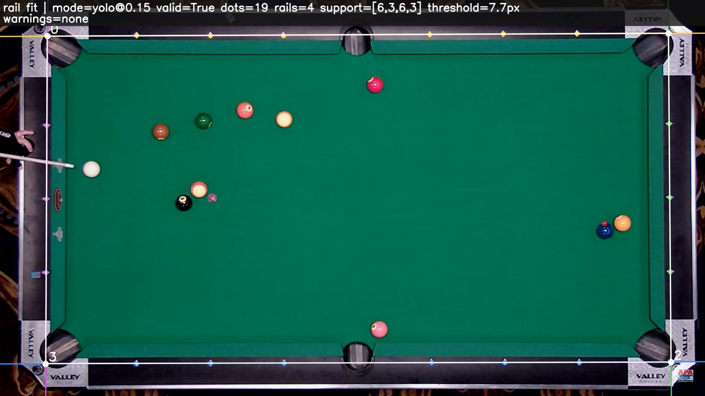</td>
    <td>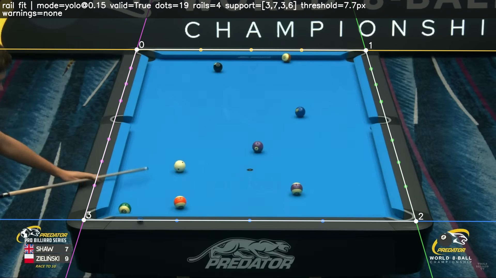</td>
  </tr>
  <tr>
    <td align="center">Overhead camera: 6/3/6/3 sights per rail, 0.59 px corner error</td>
    <td align="center">Angled broadcast camera: 0.59 px corner error</td>
  </tr>
</table>

Ball and sight predictions on eight validation frames (left: labels, right: model):

<table>
  <tr>
    <td>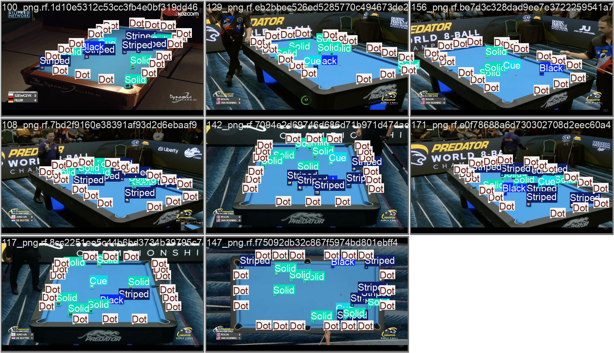</td>
    <td>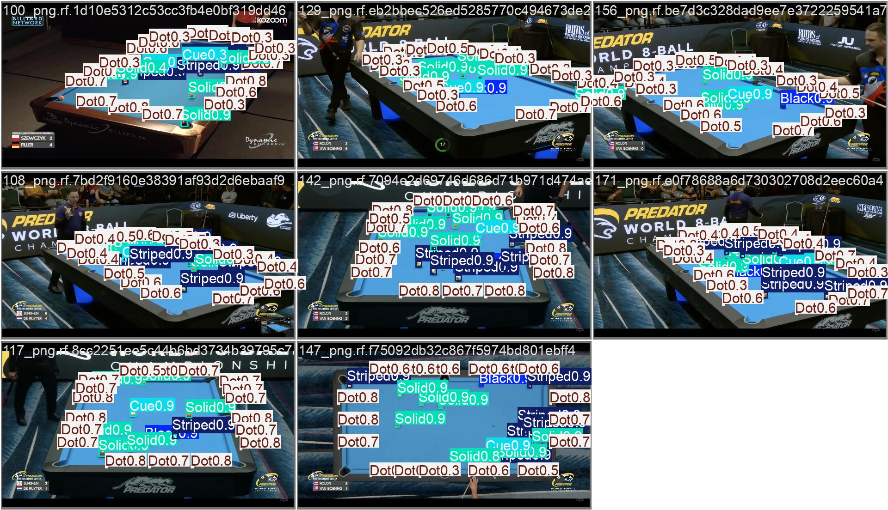</td>
  </tr>
</table>

## 📊 Results

Best model: [`outputs/yolo11s-1920/weights/best.pt`](outputs/yolo11s-1920/weights/best.pt), measured on the 20-image validation split. The test split is sealed and has not been used. Full report: [`outputs/yolo11s-1920/RESULTS.md`](outputs/yolo11s-1920/RESULTS.md).

| Class | Instances | Precision | Recall | mAP50 | mAP50-95 |
|---|---:|---:|---:|---:|---:|
| **All** | 582 | **0.938** | **0.929** | **0.952** | **0.770** |
| Black | 20 | 0.954 | 0.900 | 0.943 | 0.807 |
| Cue | 20 | 0.960 | 1.000 | 0.995 | 0.905 |
| Dot (rail sight) | 359 | 0.854 | 0.844 | 0.895 | 0.494 |
| Solid | 97 | 0.960 | 0.948 | 0.963 | 0.829 |
| Striped | 86 | 0.965 | 0.952 | 0.966 | 0.815 |

<table>
  <tr>
    <td>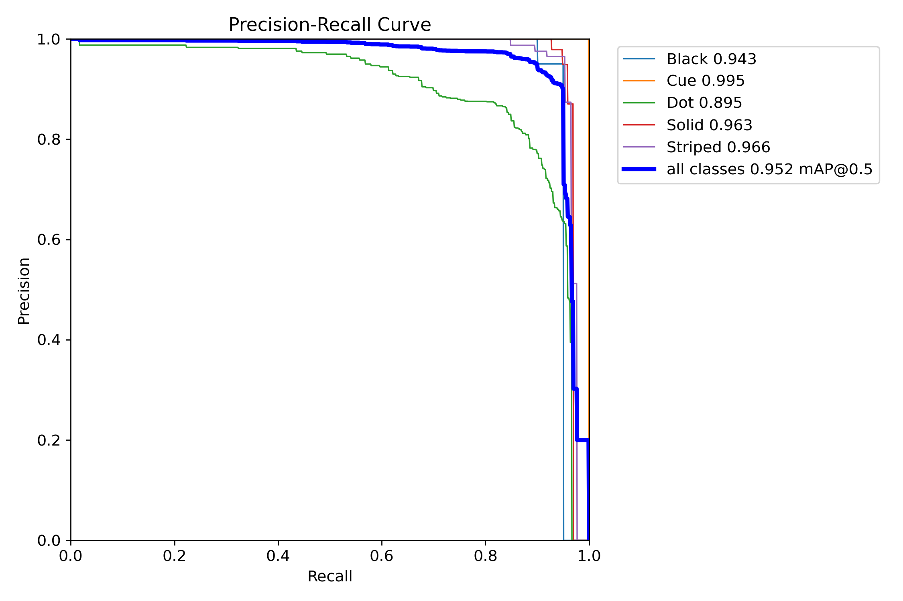</td>
    <td>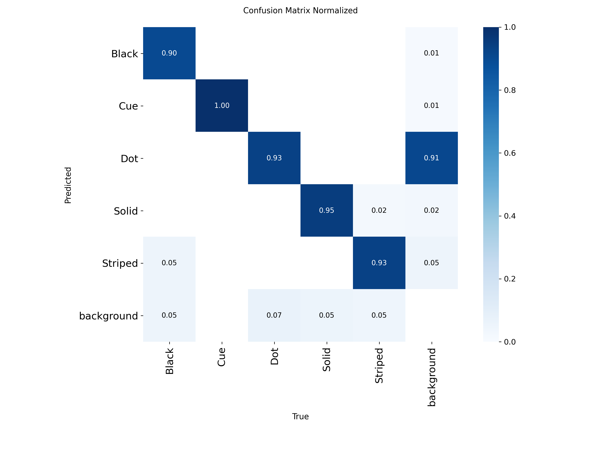</td>
  </tr>
  <tr>
    <td align="center">Precision–recall per class</td>
    <td align="center">Normalized confusion matrix</td>
  </tr>
</table>

**Rail sights as points.** Rail fitting consumes sight *centres*, so sights are also scored by one-to-one centre matching within 16 px. At confidence 0.20 the model finds 356 of 359 sights. The 112 false positives it also returns are absorbed by the line fitting, which ignores points that are not collinear.

**Rail reconstruction.** Every Dot confidence from 0.05 to 0.20 fits 19 of 20 validation tables, with corners agreeing with those fitted from labelled sights. The one miss is a distant table covering under 3% of the frame, which the area gate rejects even with perfect labels. The repo runs at 0.15, mid-plateau.

<details>
<summary>Training curves</summary>

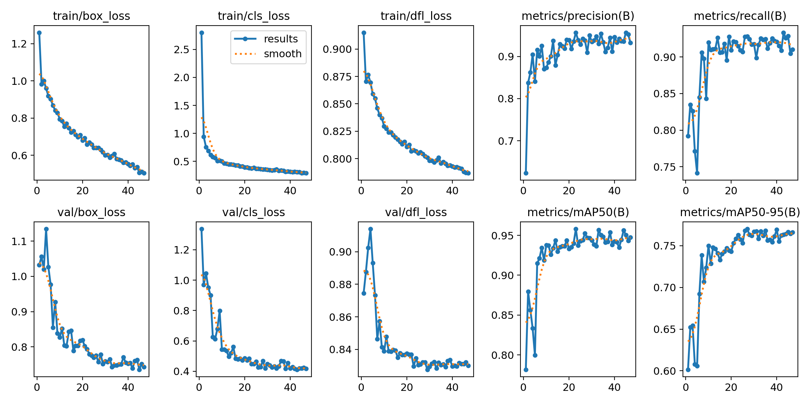

</details>

## 🏗️ Architecture

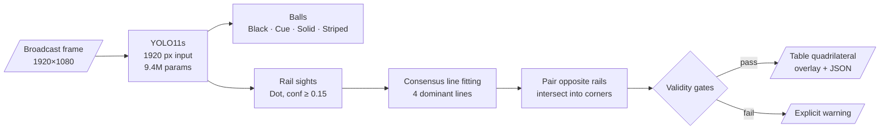

**Detector.** COCO-pretrained YOLO11s (9.4M parameters, 21.4 GFLOPs) fine-tuned at 1920 px. The broadcast frames are 1920 px wide, so the sights are never downscaled.

| Setting | Value |
|---|---|
| Recipe | [`configs/train_yolo11s_1920.yaml`](configs/train_yolo11s_1920.yaml) |
| Batch / nominal batch | 4 / 4 |
| Epochs | early stopping (patience 20); best epoch 27 of 47 |
| Mixed precision | on (AMP) |
| Augmentation | horizontal flip 0.5, mild HSV jitter; mosaic, scale, translate and mixup off |
| Seed | 42, deterministic |

Augmentation is deliberately light. Mosaic and scale jitter would break the one-table-per-frame geometry the sights depend on.

**Rail fitting** ([`scripts/geometry.py`](scripts/geometry.py)) knows nothing about YOLO; it takes unordered points from labels or the detector.
1. Treat every pair of sight centres as a line hypothesis and collect the points within 0.4% of the image size.
2. Refine each hypothesis by least squares, keep the line with the most support, remove its points, and repeat until four rails are found.
3. Pair the most parallel rails as opposite sides and intersect neighbours into four corners.
4. Accept only convex quadrilaterals covering 3–95% of the frame, with corners near the image and adjacent rails at least 12° apart. Otherwise return a named warning.

## 📂 Dataset

[8-Ball Pool v3](https://universe.roboflow.com/bachelorthesis/8-ball-pool-l530o/dataset/3) from Roboflow (CC BY 4.0): 247 broadcast frames with 7,243 boxes.

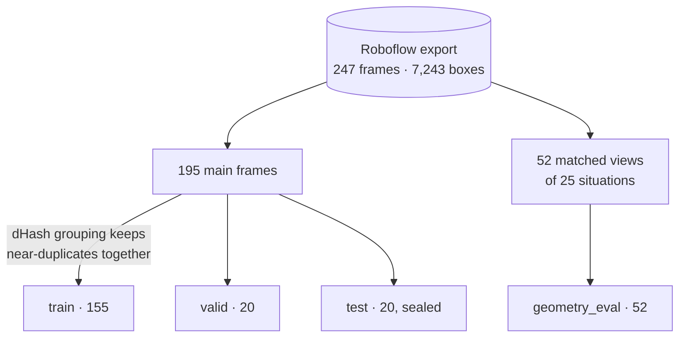

| Split | Frames | Black | Cue | Dot | Solid | Striped | Boxes |
|---|---:|---:|---:|---:|---:|---:|---:|
| train | 155 | 152 | 154 | 2,780 | 743 | 665 | 4,494 |
| valid | 20 | 20 | 20 | 359 | 97 | 86 | 582 |
| test | 20 | 19 | 20 | 356 | 96 | 85 | 576 |
| geometry_eval | 52 | 51 | 51 | 931 | 289 | 269 | 1,591 |

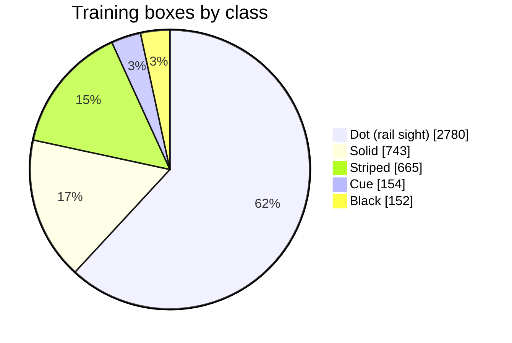

**Preparation.**
- Mixed segmentation polygons were converted to tight boxes, and a duplicate label file was removed.
- Splits are grouped by perceptual hash (dHash), so near-identical frames never straddle train and validation.
- Rail sights make up 61% of the boxes but are the hardest class, because every one is under 32×32 px.

## 🔬 Model development

Resolution was the decisive lever for the tiny sights. Each step kept the same data and augmentation policy:

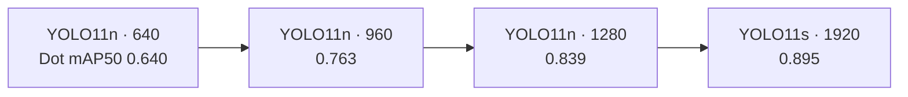

The 960 and 1280 runs are kept for reference in [`outputs/yolo11n-960/`](outputs/yolo11n-960/RESULTS.md) and [`outputs/yolo11n-1280/`](outputs/yolo11n-1280/RESULTS.md).

## ⚙️ Getting started

```powershell
python -m venv .venv
.\.venv\Scripts\pip install torch torchvision --index-url https://download.pytorch.org/whl/cu126
.\.venv\Scripts\pip install ultralytics==8.4.124 pytest

# Detect sights and fit the rails on your own image or folder
.\.venv\Scripts\python.exe scripts\fit_table_rails.py --source "C:\path\to\frame.jpg" --output outputs\yolo11s-1920\my-test

# Re-run the validation evaluations
.\.venv\Scripts\python.exe scripts\analyze_dot_centers.py      # sight-centre precision/recall
.\.venv\Scripts\python.exe scripts\analyze_detector_errors.py  # per-class errors and gallery
.\.venv\Scripts\python.exe scripts\sweep_rail_confidence.py    # Dot confidence vs rail-fit success

.\.venv\Scripts\pytest.exe -q
```

All scripts default to the best model. Add `--device cpu` without a CUDA GPU. Rail-fitting warnings:

| Warning | Meaning |
|---|---|
| `insufficient_dot_points` | fewer than 12 sight candidates |
| `four_rails_not_found` | a rail lacked three collinear sights |
| `quadrilateral_too_small` | the table covers under 3% of the frame |
| `corner_outside_allowed_margin` | rails intersect implausibly far outside the frame |

## 🏋️ Training

The 1920 recipe needs about 16 GB of GPU memory; a free Google Colab T4 is enough. Store a read-only GitHub token for this repo as the Colab secret `GITHUB_TOKEN`, then run:

```python
from google.colab import drive, userdata
drive.mount('/content/drive')
token = userdata.get('GITHUB_TOKEN')
!git clone -q https://{token}@github.com/trietsim69-boop/8ballpool.git /content/8ballpool
%cd /content/8ballpool
!pip install -q ultralytics==8.4.124
!yolo detect train cfg=configs/train_yolo11s_1920.yaml project=/content/drive/MyDrive/8ballpool/outputs
```

- **Batch size:** keep `nbs` equal to `batch`; a smaller `nbs` silently increases weight decay. On out-of-memory errors use `batch=2 nbs=2`.
- **Disconnects:** results survive them on Google Drive. Resume with `!yolo train resume model=<run>/weights/last.pt`.

## ⚠️ Limitations

- **Small validation set:** 20 images, so one hard frame moves recall by several percent. The sealed test split has not been run.
- **Broadcast domain only:** a personal phone photo produced too few sights with an earlier model.
- **Rail plane, not bed plane:** the fitted quadrilateral runs through the sights on the raised rail cap, not the playing surface.
- **Laptop limits:** the development laptop (2 GB GPU) can train only the small 960 px model. Inference with the 1920 model needs a few GB of free system memory.

## 📁 Repository

```text
configs/train_yolo11s_1920.yaml   best training recipe
configs/geometry.yaml             rail-fitting thresholds and Dot confidence (0.15)
scripts/geometry.py               rail fitting from sight centres
scripts/*.py                      detection, evaluation and rail-fitting tools
tests/                            unit tests
outputs/yolo11s-1920/             best model: weights, curves, evaluations, RESULTS.md
outputs/yolo11n-960/, yolo11n-1280/  earlier runs
data/processed/pix2pockets_v3/    dataset splits
```
