# Table Detection Plan

Status: approved scope; implementation has not started  
Scope: five-class YOLO11 detection followed by rail fitting, homography, and normalized ball projection  
Initial image domain: championship and broadcast still images represented by the Pix2Pockets dataset

## 1. Goal and phase boundary

The table-detection work will be learned and implemented in two separate phases:

```text
Phase 1: image -> YOLO11 -> ball and dot detections
Phase 2: dot detections -> rail lines -> table corners -> homography
                              + ball detections -> normalized ball positions
```

Phase 1 must work and be understandable on its own before Phase 2 begins. Phase 2 will first be developed with ground-truth dot annotations so geometry errors are not confused with model errors. Only after the geometry works will predicted dots be connected to it.

The output of this work is a detected, normalized table state. Shot generation, ranking, physics, reinforcement learning, video tracking, and a production user interface are outside this plan.

## 2. Learning method

Every checkpoint follows the same loop:

1. Learn the concept being introduced.
2. Run one small, observable experiment.
3. Save its configuration and outputs.
4. Inspect the outputs instead of relying on one summary metric.
5. Answer the checkpoint questions.
6. Change only one important variable before the next experiment.

This keeps the two major uncertainties separate:

- **Detection uncertainty:** Did YOLO find and classify the balls and dots correctly?
- **Geometry uncertainty:** Given correct dot centres, did the rail and homography algorithm reconstruct the table correctly?

## 3. Confirmed starting point

### Dataset

Use only the generated dataset configuration:

```text
data/processed/pix2pockets_v3/data.yaml
```

Do not train with the `data.yaml` from the raw Roboflow export because it references validation and test directories that do not exist.

| Split | Images | Boxes | Purpose |
|---|---:|---:|---|
| `train` | 155 | 4,495 | Learn detector weights |
| `valid` | 20 | 582 | Choose checkpoints, thresholds, and training settings |
| `test` | 20 | 576 | Sealed detector evaluation; exact final protocol is deferred |
| `geometry_eval` | 52 | 1,591 | Matched views from 25 situations for homography development and evaluation |

The five classes remain unchanged and keep the dataset class order:

```text
0 Black
1 Cue
2 Dot
3 Solid
4 Striped
```

The processed dataset contains paired images and labels in every split. The known mixed polygon row in `18t` was converted to a detection box in the processed copy. Treat the raw Roboflow export and the generated processed data as immutable inputs.

### Current local machine

- GPU: NVIDIA GeForce MX550 with 2 GB VRAM.
- Python: 3.12.10 in the project `.venv`.
- PyTorch: `2.9.0+cu126`; CUDA is available and identifies the MX550.
- Ultralytics: `8.4.124`.
- Torchvision: `0.24.0+cu126`.
- OpenCV: `5.0.0`; PyYAML: `6.0.3`; pytest: `9.1.1`.
- Local training will be GPU-first, with CPU used only for diagnostics or fallback.

Two gigabytes of VRAM is a real training constraint, but the measured smoke tests show that batch `2` fits at both `512` and `640`. The `640` run peaked at about `0.63 GB` as reported by Ultralytics, so `640` is the selected baseline resolution. Keep batch `1` as the fallback if a later configuration uses more memory.

Ultralytics' AMP compatibility check reports anomalies with this local PyTorch/GPU combination, so the verified runs use `amp=False`. Re-test AMP only as a separate controlled experiment; do not silently enable it in the baseline.

### Repository reproducibility note

The processed dataset exists, but the dataset-preparation scripts shown in the broader technical plan are currently missing or deleted from the working tree. This does not block the two phases below. It is a separate repository-reproducibility issue that must be resolved before claiming that a fresh checkout can regenerate the dataset.

## 4. Proposed implementation map

This document does not create these implementation files. It establishes where later work should live.

```text
pyproject.toml
configs/
    train.yaml                 # reproducible YOLO training settings
    geometry.yaml              # RANSAC and geometry thresholds
scripts/
    train_detector.py          # smoke and baseline training entry point
    evaluate_detector.py       # metrics, predictions, and error gallery
    select_geometry_cases.py   # grouped clear-image development selection
src/billiards/
    detection.py               # model loading, inference, and post-processing
    geometry.py                # rail fitting, corners, correspondence, homography
    calibration.py             # manual four-corner fallback
    schemas.py                 # typed detection and geometry results
    rendering.py               # source overlays and top-down diagnostics
tests/
    test_detection_postprocess.py
    test_geometry.py
    fixtures/
outputs/
    detection/
    geometry/
```

Training settings belong in configuration or recorded run arguments, not as unexplained constants scattered through source files.

## 5. Prerequisite checkpoint — local environment

### Concept to learn

PyTorch can be installed as a CPU build or a CUDA-enabled build. Local GPU training requires the CUDA-enabled build even when Windows and the NVIDIA driver can already see the GPU. VRAM is the GPU's working memory for input tensors, feature maps, gradients, and optimizer state.

### Actions

Create and activate an isolated Python 3.12 environment:

```powershell
py -3.12 -m venv .venv
.\.venv\Scripts\Activate.ps1
python -m pip install --upgrade pip
```

Use the current command generated by the official PyTorch **Start Locally** selector for Windows, Pip, Python, and a CUDA build supported by PyTorch. Do not guess an old CUDA package URL. Then install the project-level packages:

```powershell
python -m pip install ultralytics opencv-python pyyaml pytest
```

Record the resolved package versions after installation:

```powershell
python -m pip freeze
```

Verify the runtime before training:

```powershell
nvidia-smi
python -c "import torch; print(torch.__version__); print(torch.version.cuda); print(torch.cuda.is_available()); print(torch.cuda.get_device_name(0) if torch.cuda.is_available() else 'CPU only')"
python -c "from ultralytics import YOLO; print('Ultralytics import OK')"
```

### Expected result

- The virtual environment uses Python 3.12.
- `torch.cuda.is_available()` prints `True`.
- PyTorch identifies the MX550.
- Ultralytics imports successfully.
- The installed versions are recorded for the future `pyproject.toml` or lock file.

### Stop condition

Do not begin model training if PyTorch still reports a CPU-only build. Resolve the environment first so training speed is not misdiagnosed as a model or dataset problem.

---

# Phase 1 — Five-Class Ball and Dot Detection

## 6. Phase 1 outcome

Given one broadcast-style pool image, YOLO11 should return candidate boxes for:

- `Black`
- `Cue`
- `Dot`
- `Solid`
- `Striped`

The phase ends with a selected checkpoint, repeatable inference, reviewable diagnostics, and both raw and post-processed detections. Formal final accuracy targets are deliberately deferred, but the prototype gates in this document must pass.

## 7. Checkpoint 1.1 — understand and load the data

### Concept to learn

A YOLO detection row contains:

```text
class_id x_center y_center width height
```

The four coordinates are normalized relative to the source image. Training uses the `train` split to update weights. The `valid` split guides choices. The `test` split must not guide choices or it stops being an honest test.

### Actions

1. Load `data/processed/pix2pockets_v3/data.yaml` through Ultralytics.
2. Render labelled samples from every class.
3. Inspect examples with:
   - a distant or small table;
   - steep camera perspective;
   - dark and bright lighting;
   - partially hidden rails;
   - visually similar cue and black balls;
   - small rail dots near logos or highlights.
4. Confirm that resizing uses letterboxing and does not stretch the table.

### Expected artifacts

- A labelled contact sheet or equivalent sample grid.
- A recorded class map.
- A short list of anticipated failure modes.

### Questions before continuing

- Can every class be recognized in the rendered labels?
- Are any balls or dots visibly missing annotations?
- Which objects become very small after a `512` or `640` letterbox resize?
- Could broadcast text, lights, or logos be mistaken for dots?

## 8. Checkpoint 1.2 — overfit a tiny sample

### Concept to learn

Before a full run, a detector should be able to memorize a very small, representative subset. Failure to do this usually indicates a configuration, label, path, or environment problem—not insufficient training time.

### Actions

1. Select roughly 8–12 training images containing all five classes.
2. Train YOLO11n on only that subset long enough to visibly overfit it.
3. Run predictions on the same images.
4. Confirm that boxes and class names line up with the annotations.

### Expected result

Training loss should fall and predictions on this deliberately reused subset should become strong. This result is a pipeline sanity check, not an accuracy claim.

### Stop condition

Do not start the full baseline if the model cannot learn the tiny sample. Inspect class order, label parsing, image paths, and CUDA execution first.

### Completed result

- Subset: 10 training images, 289 boxes, all five classes.
- Model/input: YOLO11n at `512`, batch `1`, 50 epochs, augmentation disabled.
- Crucial setting: `nbs=1` so each physical batch performs an optimizer update.
- Independent saved-checkpoint result: precision `0.8983`, recall `0.8529`, mAP50 `0.8962`, mAP50-95 `0.7349`.
- Per-class mAP50: Black `0.885`, Cue `0.962`, Dot `0.753`, Solid `0.949`, Striped `0.933`.
- Acceptance script: `python -m scripts.check_tiny_overfit`.
- Artifacts: `runs/detect/outputs/detection/tiny-overfit-nbs1-yolo11n-512/`.

Learning note: `batch` is the number of images processed together in GPU memory. `nbs` is Ultralytics' nominal batch used to choose gradient accumulation. With batch `1` and the default `nbs=64`, the 10-image experiment performed optimizer steps too rarely and appeared unable to learn. Match `nbs` to the physical batch for short diagnostic runs unless deliberate gradient accumulation is part of the experiment.

## 9. Checkpoint 1.3 — two-to-three-epoch smoke test

### Concept to learn

A smoke test checks that the complete training and validation pipeline can run without committing to a long experiment.

### Initial local command

The later training script should expose the same settings, but the first run may use the Ultralytics CLI directly:

```powershell
yolo detect train `
  model=yolo11n.pt `
  data="data/processed/pix2pockets_v3/data.yaml" `
  imgsz=640 `
  batch=2 `
  nbs=2 `
  epochs=3 `
  device=0 `
  workers=0 `
  cache=False `
  amp=False `
  seed=42 `
  plots=True `
  project="outputs/detection" `
  name="smoke-yolo11n-640"
```

`workers=0` is conservative for the first Windows run. It can be increased later only after the pipeline is stable.

### VRAM adaptation sequence

1. Run `512`, batch `2`.
2. If stable, repeat the smoke test at `640`, batch `2`.
3. If `640` runs out of memory, retry `640` with batch `1`; return to `512` only if that also fails.
4. Do not lower image size silently; include the chosen size in every run name and result report.

### Expected artifacts

- `last.pt` and `best.pt` from the smoke run.
- Training and validation loss plots.
- Precision-recall and confusion-matrix plots where available.
- Sample validation predictions.
- Peak GPU memory and approximate time per epoch.

### Questions before continuing

- Did CUDA, rather than CPU, perform the training?
- Was GPU memory stable?
- Could the full dataset and validation split be loaded?
- Did each class appear in metrics and sample predictions?
- Is `640` locally practical, or is `512` the honest baseline?

### Completed results

Both runs used the real 155-image training split and untouched 20-image validation split. Every image loaded with zero corrupt records.

| Run | Peak GPU memory | Precision | Recall | mAP50 | mAP50-95 | Dot AP50 |
|---|---:|---:|---:|---:|---:|---:|
| `smoke-yolo11n-512` | about 0.44 GB | 0.523 | 0.586 | 0.487 | 0.283 | 0.310 |
| `smoke-yolo11n-640` | about 0.63 GB | 0.498 | 0.719 | 0.650 | 0.437 | 0.498 |

These are pipeline and capacity results, not final accuracy claims. `640` is selected because it fits comfortably and is substantially better for the small rail-dot class in this controlled smoke comparison. Saved artifacts live under `outputs/detection/`.

## 10. Checkpoint 1.4 — reproducible YOLO11n baseline

### Concept to learn

The baseline is the simplest serious experiment. Its purpose is to establish evidence about the dataset and failure modes, not to maximize every metric immediately.

### Provisional baseline settings

These settings must be recorded in `configs/train.yaml`. They are a starting configuration, not permanently approved hyperparameters.

| Setting | Initial value | Reason |
|---|---:|---|
| Model | `yolo11n.pt` | Smallest pretrained YOLO11 detector |
| Image size | `640` | Smoke-tested; improves small-dot detection and fits locally |
| Batch | `2` | Smoke-tested on the MX550 at `640` |
| Nominal batch (`nbs`) | `2` | One optimizer update per physical batch for this small dataset |
| AMP | `False` | Local Ultralytics compatibility check reported AMP anomalies |
| Maximum epochs | `100` | Allows a useful baseline without copying the paper's 2,000 epochs blindly |
| Patience | `20` | Stop after a sustained validation plateau |
| Device | `0` | Local NVIDIA GPU |
| Seed | `42` | Repeatable run setup |
| Cache | `False` | Conservative local memory use |
| Mosaic / MixUp | `0` initially | Avoid unnatural multi-table composites in the first baseline |
| Horizontal flip | mild/standard | Table semantics are left-right symmetric |
| Photometric changes | mild | Represent broadcast lighting variation |
| Aggressive crop | disabled | Preserve balls, rails, and dot context |

The paper trained a YOLOv5 detector at `640 x 640` and reported an average AP50 of `91.2%` after post-processing. Treat this as historical context, not a pass/fail threshold for a different YOLO version and implementation.

### Actions

1. Train with the selected local image size.
2. Save configuration, package versions, seed, run name, and hardware information.
3. Select the checkpoint using validation evidence only.
4. Preserve both `last.pt` and `best.pt` plus all generated plots.
5. Do not open the detector test results to make further model choices.

### Expected result

A repeatable YOLO11n baseline exists, even if its accuracy is not yet satisfactory. The next step is diagnosis, not immediate hyperparameter searching.

## 11. Checkpoint 1.5 — interpret validation results

### Concept to learn

Aggregate mAP can hide the errors that matter most downstream. Phase 2 needs enough correctly located dots on each rail, while shot analysis needs correct ball classes. Both concerns must be inspected separately.

### Required detector views

- Per-class precision and recall.
- Per-class AP50 and AP50-95.
- Confusion matrix, especially:
  - `Cue` versus `Black`;
  - `Solid` versus `Striped`.
- False-negative gallery for small balls.
- False-positive gallery for dots.
- Results grouped by approximate box size.
- Raw dot count per image.
- Qualitative dot coverage around each visible rail.

### Error categories

Assign every important failure to one primary category:

1. Missing annotation or ambiguous label.
2. Object too small after resizing.
3. Occlusion or truncation.
4. Class confusion.
5. Duplicate overlapping prediction.
6. Dot-like background texture, light, or logo.
7. Viewpoint or lighting domain shift.

### Experiment rule

Run only an experiment that responds to an observed error:

- Try `640` instead of `512` when small objects are missed and memory permits.
- Compare `yolo11s.pt` only if YOLO11n appears capacity-limited and the hardware can run it.
- Add mild photometric augmentation when lighting drives failures.
- Tune confidence thresholds only after reviewing precision-recall behavior.
- Do not change model size, image size, augmentation, and thresholds in the same comparison.

## 12. Checkpoint 1.6 — inference contract and post-processing

### Concept to learn

Raw neural-network output is evidence, not yet a trusted table state. Domain rules can remove impossible duplicates, but every filtered result must remain traceable to its raw prediction.

### Detection contract

Each raw detection should carry at least:

```json
{
  "class_id": 2,
  "class_name": "Dot",
  "confidence": 0.87,
  "box_xyxy": [120.0, 42.0, 129.0, 51.0],
  "center_xy": [124.5, 46.5],
  "source": "raw"
}
```

Keep coordinates in the original image space after reversing letterbox transforms.

### Initial post-processing rules

- Apply class-agnostic NMS to strongly overlapping ball predictions.
- Keep at most one cue ball and one black ball, with warnings when alternatives were removed.
- Keep at most seven solids and seven stripes.
- Keep at most sixteen balls total.
- Treat eighteen rail dots as the expected full-table maximum, not as proof that geometry is correct.
- Reject extreme dot sizes only through a recorded, validation-derived rule.
- Preserve raw and filtered detections in diagnostics.

Do not use post-processing to conceal systematic detector failures. If correct low-confidence objects are repeatedly removed, fix or retune the rule using validation data.

## 13. Phase 1 prototype gates

Phase 1 is ready to feed Phase 2 when:

- The Python/CUDA/Ultralytics environment is reproducible.
- The tiny-sample overfit check passes.
- A 2–3 epoch smoke test completes on the local GPU.
- A recorded YOLO11n baseline completes at `640` or the documented `512` fallback.
- All five classes appear in representative predictions.
- Validation artifacts and an error gallery are saved.
- Raw and post-processed detections use a stable JSON/schema contract.
- Clear, fully visible tables retain enough dot detections to attempt four-rail reconstruction.

These are prototype gates, not final performance claims. Exact detector acceptance metrics and the sealed test protocol will be decided later.

---

# Phase 2 — Rail Fitting, Homography, and Ball Projection

## 14. Phase 2 outcome

Given correct dot centres and ball detections, Phase 2 should:

1. Recover the four table rails.
2. Intersect them into a valid table quadrilateral.
3. Match the detected rail dots to a canonical table template.
4. Estimate an image-to-table homography.
5. Project detected ball anchors into normalized table coordinates.
6. Save visual diagnostics and structured results.
7. Fail explicitly or request manual calibration when automatic geometry is invalid.

The first implementation targets clear images with the whole table visible and the full or nearly full dot pattern. Missing-dot and heavy-occlusion robustness is a later extension, not a hidden requirement for the first geometry checkpoint.

## 15. Checkpoint 2.1 — reserve geometry development data

### Concept to learn

The 52 geometry images contain 25 matched pool situations viewed from different angles. Images from the same situation are correlated and must stay together. Otherwise, geometry choices can be tuned on one view and evaluated on an almost identical table state.

### Actions

1. Group `geometry_eval` images by situation identifier.
2. Reserve whole situations for:
   - geometry development;
   - sealed geometry evaluation.
3. Defer the exact group counts and formal metrics until the prototype algorithm is understood.
4. Within the development groups, identify clear images with a visible full dot pattern.
5. Record the selection in a manifest rather than copying files informally.

### Stop condition

Do not tune geometry thresholds on the sealed situation groups.

## 16. Checkpoint 2.2 — establish coordinate systems and schemas

### Concept to learn

Homography mistakes often come from mixing coordinate systems. Keep these names explicit:

- **Image coordinates:** original source-image pixels.
- **Model coordinates:** resized and letterboxed YOLO input.
- **Table coordinates:** normalized `x in [0, 2]`, `y in [0, 1]`.
- **Render coordinates:** optional diagnostic canvas, initially `1000 x 500` pixels.

The four canonical table corners are:

```text
(0, 0)             (2, 0)
(0, 1)             (2, 1)
```

The six canonical pocket centres, used later by the shot-analysis pipeline, are:

```text
(0, 0)   (1, 0)   (2, 0)
(0, 1)   (1, 1)   (2, 1)
```

The `(1, 0)` and `(1, 1)` points are side-pocket centres, not additional corners.

### Initial canonical dot hypothesis

- Long rails: `x = 0.25, 0.50, 0.75, 1.25, 1.50, 1.75` at `y = 0` and `y = 1`.
- Short rails: `y = 0.25, 0.50, 0.75` at `x = 0` and `x = 2`.

Visually verify these positions against labelled clear images before fixing them in code.

### Geometry result contract

```json
{
  "method": "automatic_dots",
  "valid": true,
  "confidence": null,
  "rail_lines": [],
  "corners_image_xy": [],
  "homography_image_to_table": [],
  "dot_inliers": [],
  "mean_reprojection_error": null,
  "max_reprojection_error": null,
  "warnings": []
}
```

Confidence calibration is deferred, so it may remain `null` during the first clear-image prototype. Validity checks and warnings are still required.

## 17. Checkpoint 2.3 — extract ground-truth dot centres

### Concept to learn

Ground-truth boxes isolate the geometry algorithm from detector performance. A box centre is sufficient for the first dot representation.

### Actions

1. Read class `Dot` rows from selected clear-image labels.
2. Convert normalized YOLO coordinates into original pixel coordinates.
3. Draw the centre of every dot over the source image.
4. Verify the count and spatial order visually.
5. Save both the points and overlay.

### Expected result

Every selected dot centre lies on one of the four physical table rails. If it does not, resolve label conversion or selection errors before fitting lines.

## 18. Checkpoint 2.4 — fit four rail lines

### Concept to learn

Ordinary slope-intercept form fails for vertical lines. Represent every rail as:

```text
a*x + b*y + c = 0
```

with a normalized `(a, b)` vector. RANSAC repeatedly proposes a line and selects nearby dot centres as inliers, allowing some incorrect or noisy points to be ignored.

### Initial clear-image algorithm

1. Fit the line supported by the most remaining dot centres.
2. Save its inliers and remove them from the candidate pool.
3. Repeat until four lines are found.
4. Require each line to have plausible dot support.
5. Enumerate valid side orderings and intersect adjacent rails.
6. Choose an ordering that produces a convex four-corner polygon containing the playing surface.

Do not assume opposite rails remain parallel in the image; perspective projection can make them converge.

### Required diagnostics

- Every dot centre, colored as an inlier or outlier.
- Each fitted infinite line.
- The finite rail segment used in the quadrilateral.
- The four numbered corner intersections.
- RANSAC thresholds and support counts in JSON.

### Prototype checks

- Exactly four plausible rail lines are produced.
- Adjacent intersections form a convex quadrilateral.
- The quadrilateral covers a plausible portion of the image.
- Each rail's inlier dots appear ordered along the visible rail.

## 19. Checkpoint 2.5 — match dots to the canonical table

### Concept to learn

A homography requires corresponding source and destination points in the same order. The first prototype can use complete dot patterns, making correspondence explicit before handling missing detections.

### Actions

1. Determine which two sides are long rails and which two are short rails using dot support and quadrilateral layout.
2. Project dot centres onto their rail direction and sort by that scalar position.
3. Map six long-rail dots and three short-rail dots to the verified canonical positions.
4. Add the four inferred rail intersections as virtual corner correspondences.
5. Draw a numbered correspondence overlay on both source and template views.

With eighteen rail dots and four inferred corners, up to twenty-two correspondences are available.

### Stop condition

Do not estimate the homography if the correspondence order is visually wrong. A numerically valid matrix built from incorrect pairs can produce a convincing but false result.

## 20. Checkpoint 2.6 — estimate and validate the homography

### Concept to learn

A homography is a `3 x 3` projective transform, defined up to scale, that maps points between two planes. `cv2.findHomography` can use RANSAC to ignore inconsistent correspondences.

### Actions

1. Call `cv2.findHomography(source_points, table_points, cv2.RANSAC, threshold)`.
2. Normalize the returned matrix consistently.
3. Reproject every accepted source correspondence back into table coordinates.
4. Compute mean and maximum reprojection error.
5. Warp the source image to a top-down diagnostic view.
6. Reject results with non-finite values, incorrect orientation, invalid corners, insufficient inliers, or excessive reprojection error.

The RANSAC threshold and rejection limits belong in `configs/geometry.yaml`. Their exact values must be learned from geometry-development examples and recorded; they must not be tuned against sealed evaluation situations.

### Expected artifacts

- Source image with dots, rails, corners, and point identifiers.
- Top-down warped table image.
- Reprojection residual visualization.
- Geometry JSON containing the matrix, inlier mask, errors, warnings, and validity result.

## 21. Checkpoint 2.7 — project ground-truth ball boxes

### Concept to learn

The homography transforms points, not boxes. The first ball anchor is the centre of each ground-truth ball box. Angled views can bias that point, so view-aware anchor refinement is deferred until the basic transform is proven.

### Actions

1. Convert each ground-truth ball box centre to original image pixels.
2. Transform it using `cv2.perspectiveTransform` or equivalent homogeneous-coordinate logic.
3. Reject non-finite points and points clearly outside the normalized table plus a small diagnostic tolerance.
4. Render the class-colored ball centres on a `2:1` top-down canvas.
5. Compare matched angled/front views visually with their top-view reference.

### Expected result

The projected layout should preserve the recognizable relative ball arrangement. Formal centimetre or normalized-error targets are deferred, but obviously mirrored, rotated, or displaced layouts fail the prototype gate.

## 22. Checkpoint 2.8 — replace ground truth with YOLO predictions

### Concept to learn

This is the first integration checkpoint. Geometry that worked with labels can now fail because of missing dots, false dots, or imprecise centres. The diagnostic output must show which phase caused the failure.

### Actions

1. Run the selected Phase 1 checkpoint on the same clear development images.
2. Pass filtered `Dot` centres into the unchanged geometry interface.
3. Pass filtered ball detections into the projection step.
4. Compare predicted-dot geometry with ground-truth-dot geometry.
5. Record detector failures separately from rail, correspondence, and homography failures.

### Initial scope

Require clear images with enough correct dots to reproduce the full-pattern algorithm. Do not broaden immediately to severe occlusion. First determine whether the Phase 1 detector is accurate enough on the easiest valid geometry cases.

## 23. Checkpoint 2.9 — manual four-corner fallback

### Concept to learn

Automatic geometry should fail safely. Four correctly ordered table corners are sufficient to estimate a fallback homography when the user can identify them.

### Actions

1. Display the original image.
2. Ask the user to click the four inner playing-surface corners in a documented order.
3. Show and confirm the numbered points before accepting them.
4. Compute the image-to-table homography from those four correspondences.
5. Save the calibration with the image dimensions, corner order, timestamp, and source method.
6. Reuse it only for images from the same fixed camera and unchanged framing.

### Expected behavior

- Automatic failure returns an invalid geometry result with reasons.
- The caller may explicitly choose manual calibration.
- The final JSON states whether geometry came from `automatic_dots` or `manual_corners`.
- No identity or guessed homography is silently substituted.

## 24. Phase 2 prototype gates

Phase 2 is complete at prototype level when:

- Geometry works first from ground-truth dots on selected clear development images.
- Four rails and four ordered corners are visible in saved diagnostics.
- Dot-to-template correspondences are visually verified.
- The homography produces a plausible top-down table warp.
- Ground-truth ball centres project into a recognizable normalized layout.
- Predicted dots reproduce the pipeline on several clear broadcast images.
- Predicted balls appear in plausible normalized positions.
- Invalid automatic geometry reports reasons and diagnostics.
- Manual four-corner calibration produces a valid fallback result.
- Development and sealed geometry situations are separated by situation identifier.

These gates prove the pipeline and interfaces. They do not yet prove robustness across all viewpoints or deployment domains.

## 25. Deferred robustness work

After the clear-image prototype is understood, extend Phase 2 in a separate iteration:

- Match partial dot sequences to canonical rail slots.
- Tolerate missing dots and uneven rail visibility.
- Reject dot-like logos, lights, and broadcast graphics geometrically.
- Fit rails when fewer than all eighteen dots are detected.
- Calibrate a geometry confidence score.
- Tune class-specific detector confidence thresholds for geometry utility.
- Refine angled-view ball anchors between box centre and top edge.
- Measure normalized projection error on sealed matched situations.
- Define final detector and geometry acceptance thresholds.
- Collect a separate personal-phone-image set before claiming phone-camera generalization.

## 26. Prototype working order

Follow this order and do not skip directly to predicted-dot homography:

- [x] Create Python 3.12 environment and verify CUDA PyTorch.
- [x] Install and record Ultralytics/OpenCV dependencies.
- [x] Load and visualize the processed five-class dataset.
- [x] Overfit a tiny representative training subset.
- [x] Complete YOLO11n smoke test at `512`, then attempt `640`.
- [ ] Record and train the reproducible local baseline.
- [ ] Produce validation diagnostics and an error gallery.
- [ ] Define the raw and filtered detection contract.
- [ ] Group geometry situations into development and sealed evaluation sets.
- [ ] Select clear, full-dot geometry-development images.
- [ ] Extract and visualize ground-truth dot centres.
- [ ] Fit and visualize four rail lines.
- [ ] Verify canonical dot positions and correspondence ordering.
- [ ] Estimate, validate, and visualize the homography.
- [ ] Project ground-truth ball centres into the normalized table.
- [ ] Replace ground-truth dots and balls with YOLO predictions.
- [ ] Implement and verify manual four-corner fallback.
- [ ] Record observed failure modes before planning robustness work.

## 27. Decisions deliberately deferred

The following choices require evidence from the prototype and are not silently assumed here:

- Final epoch budget and training-time budget.
- Final detector confidence and NMS thresholds.
- Whether YOLO11s is worth its memory and inference cost.
- Exact geometry development/evaluation situation counts.
- Final detector AP, precision, and recall acceptance values.
- Final automatic homography success-rate target.
- Final reprojection-error threshold.
- Phone-camera support and its required data collection.

## 28. References

- Existing project plan: [`TECHNICAL_PLAN.md`](TECHNICAL_PLAN.md)
- Existing architecture: [`ARCHITECTURE.md`](ARCHITECTURE.md)
- Processed dataset configuration: [`data/processed/pix2pockets_v3/data.yaml`](data/processed/pix2pockets_v3/data.yaml)
- Processed dataset audit: [`data/processed/pix2pockets_v3/audit_report.json`](data/processed/pix2pockets_v3/audit_report.json)
- Pix2Pockets paper: <https://arxiv.org/abs/2504.12045>
- Pix2Pockets reference implementation: <https://github.com/viktorseba/pix2pockets>
- Roboflow dataset: <https://universe.roboflow.com/bachelorthesis/8-ball-pool-l530o>
- Ultralytics YOLO11 documentation: <https://docs.ultralytics.com/models/yolo11/>
- Ultralytics training documentation: <https://docs.ultralytics.com/modes/train/>
- PyTorch local installation selector: <https://pytorch.org/get-started/locally/>

## 29. Final workflow graph

```mermaid
flowchart TD
    preparedData[(Processed dataset)]
    cudaSetup{{CUDA environment}}

    subgraph phaseOne ["Phase 1: YOLO11 Detection"]
        inspectLabels[Inspect labels]
        tinyOverfit[Overfit tiny sample]
        smokeTest[Run smoke test]
        trainBaseline[Train baseline]
        reviewMetrics[Review metrics]
        filterDetections[Filter detections]
    end

    detectorReady{Detector ready?}
    diagnoseDetector[Diagnose errors]

    subgraph phaseTwo ["Phase 2: Table Geometry"]
        splitCases[Split geometry cases]
        groundTruthDots[Use ground-truth dots]
        fitRails[Fit four rails]
        matchTemplate[Match dot template]
        estimateHomography[Estimate homography]
        projectGroundTruth[Project labelled balls]
        integratePredictions[Use YOLO predictions]
        geometryReady{Geometry valid?}
    end

    failureDiagnostics[Save failure diagnostics]
    manualCalibration[Click four corners]
    manualHomography[Estimate manual homography]
    resultArtifacts[Visuals and JSON]
    tableState([Normalized table state])
    futureWork[Missing-dot robustness]

    preparedData --> cudaSetup
    cudaSetup --> inspectLabels
    inspectLabels --> tinyOverfit
    tinyOverfit --> smokeTest
    smokeTest --> trainBaseline
    trainBaseline --> reviewMetrics
    reviewMetrics --> filterDetections
    filterDetections --> detectorReady
    detectorReady -->|"No"| diagnoseDetector
    diagnoseDetector -.-> smokeTest
    detectorReady -->|"Yes"| splitCases
    splitCases --> groundTruthDots
    groundTruthDots --> fitRails
    fitRails --> matchTemplate
    matchTemplate --> estimateHomography
    estimateHomography --> projectGroundTruth
    projectGroundTruth --> integratePredictions
    filterDetections -->|"Supplies predictions"| integratePredictions
    integratePredictions --> geometryReady
    geometryReady -->|"Yes"| resultArtifacts
    geometryReady -->|"No"| failureDiagnostics
    failureDiagnostics --> manualCalibration
    manualCalibration --> manualHomography
    manualHomography --> resultArtifacts
    resultArtifacts --> tableState
    tableState -.-> futureWork

    style phaseOne fill:#C2E5FF,stroke:#3DADFF
    style phaseTwo fill:#DCCCFF,stroke:#874FFF
    style detectorReady fill:#FFECBD,stroke:#FFC943
    style geometryReady fill:#FFECBD,stroke:#FFC943
    style diagnoseDetector fill:#FFCDC2,stroke:#FF7556
    style failureDiagnostics fill:#FFCDC2,stroke:#FF7556
    style manualCalibration fill:#FFE0C2,stroke:#FF9E42
    style tableState fill:#CDF4D3,stroke:#66D575
    style futureWork fill:#D9D9D9,stroke:#B3B3B3
```


