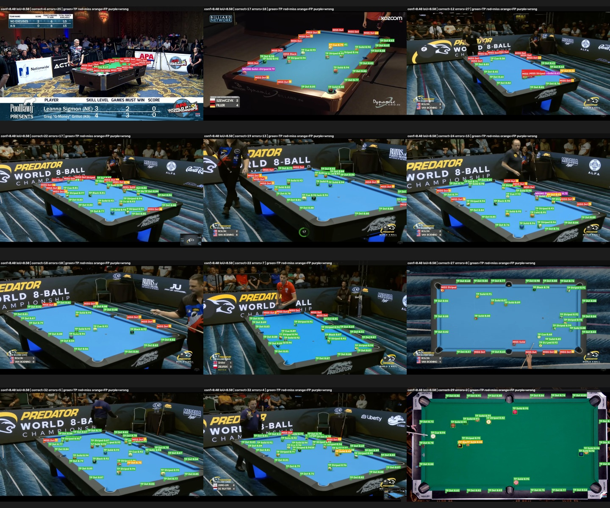

# YOLO11n Validation Error Gallery

- Images: `20`
- Ground-truth objects: `582`
- Matching IoU: `0.50`
- Selected confidence: `0.40` (highest Dot F1 in the configured sweep)
- Test split used: **no**

The selected confidence is a diagnostic validation choice, not yet the final inference contract.

## Selected-threshold metrics

| Class | TP | FP | FN | Precision | Recall | F1 |
|---|---:|---:|---:|---:|---:|---:|
| Black | 16 | 1 | 4 | 0.941 | 0.800 | 0.865 |
| Cue | 20 | 2 | 0 | 0.909 | 1.000 | 0.952 |
| Dot | 281 | 42 | 78 | 0.870 | 0.783 | 0.824 |
| Solid | 83 | 3 | 14 | 0.965 | 0.856 | 0.907 |
| Striped | 75 | 2 | 11 | 0.974 | 0.872 | 0.920 |
| all | 475 | 50 | 107 | 0.905 | 0.816 | 0.858 |

## Recall by ground-truth box size

COCO-style pixel-area groups are used: small `<32x32`, medium `32x32–96x96`, and large `>=96x96`.

| Class | Size group | GT | Matched | Recall |
|---|---|---:|---:|---:|
| Black | medium_32_to_96px | 12 | 10 | 0.833 |
| Black | small_lt_32px | 8 | 6 | 0.750 |
| Cue | medium_32_to_96px | 11 | 11 | 1.000 |
| Cue | small_lt_32px | 9 | 9 | 1.000 |
| Dot | small_lt_32px | 359 | 281 | 0.783 |
| Solid | medium_32_to_96px | 46 | 46 | 1.000 |
| Solid | small_lt_32px | 51 | 37 | 0.725 |
| Striped | medium_32_to_96px | 39 | 38 | 0.974 |
| Striped | small_lt_32px | 47 | 37 | 0.787 |

## Visual legend

- Green: correct class and IoU match.
- Red: missed ground-truth object.
- Orange: unmatched prediction / false positive.
- Purple: prediction overlaps an object but has the wrong class.

## Worst cases

## Per-image gallery

Images are ordered by missed Dot count, then total error count.

| Image | GT dots | Predicted dots | Correct dots | Missed dots | False dot predictions | All errors |
|---|---:|---:|---:|---:|---:|---:|
| [2_png.rf.e294eab9e1b8504f18e1964e03f9e9e5.jpg](gallery/2_png.rf.e294eab9e1b8504f18e1964e03f9e9e5_errors.jpg) | 18 | 1 | 1 | 17 | 0 | 25 |
| [100_png.rf.1d10e5312c53cc3fb4e0bf319dd466ba.jpg](gallery/100_png.rf.1d10e5312c53cc3fb4e0bf319dd466ba_errors.jpg) | 18 | 13 | 8 | 10 | 5 | 18 |
| [175_png.rf.3bb291132648e4ddc6318584b8fab3f6.jpg](gallery/175_png.rf.3bb291132648e4ddc6318584b8fab3f6_errors.jpg) | 18 | 14 | 9 | 9 | 5 | 27 |
| [180_png.rf.d95ed08408ababb588c6d1af919a1ba5.jpg](gallery/180_png.rf.d95ed08408ababb588c6d1af919a1ba5_errors.jpg) | 18 | 15 | 9 | 9 | 6 | 17 |
| [129_png.rf.eb2bbec526ed5285770c494673de2c04.jpg](gallery/129_png.rf.eb2bbec526ed5285770c494673de2c04_errors.jpg) | 18 | 15 | 10 | 8 | 5 | 13 |
| [179_png.rf.61fcb6e012295881e5f82e05b6d15283.jpg](gallery/179_png.rf.61fcb6e012295881e5f82e05b6d15283_errors.jpg) | 18 | 18 | 11 | 7 | 7 | 15 |
| [156_png.rf.be7d3c328dad9ee7e3722259541a79d5.jpg](gallery/156_png.rf.be7d3c328dad9ee7e3722259541a79d5_errors.jpg) | 18 | 18 | 13 | 5 | 5 | 10 |
| [94_png.rf.914de818a4ff0d086b7cb41abc8b95fd.jpg](gallery/94_png.rf.914de818a4ff0d086b7cb41abc8b95fd_errors.jpg) | 18 | 15 | 13 | 5 | 2 | 7 |
| [147_png.rf.f75092db32c867f5974bd801ebff4919.jpg](gallery/147_png.rf.f75092db32c867f5974bd801ebff4919_errors.jpg) | 18 | 16 | 14 | 4 | 2 | 8 |
| [171_png.rf.e0f78688a6d730302708d2eec60a4bdf.jpg](gallery/171_png.rf.e0f78688a6d730302708d2eec60a4bdf_errors.jpg) | 18 | 19 | 16 | 2 | 3 | 5 |
| [108_png.rf.7bd2f9160e38391af93d2d6ebaaf966a.jpg](gallery/108_png.rf.7bd2f9160e38391af93d2d6ebaaf966a_errors.jpg) | 18 | 17 | 16 | 2 | 1 | 4 |
| [78_png.rf.e4113b07a8da6a1795e7bb7519fab19a.jpg](gallery/78_png.rf.e4113b07a8da6a1795e7bb7519fab19a_errors.jpg) | 18 | 18 | 18 | 0 | 0 | 2 |
| [190_png.rf.24ed612fdc752703c31861be4bc95545.jpg](gallery/190_png.rf.24ed612fdc752703c31861be4bc95545_errors.jpg) | 18 | 18 | 18 | 0 | 0 | 1 |
| [29_png.rf.6123f6b17b0b0752cc729beefa04a070.jpg](gallery/29_png.rf.6123f6b17b0b0752cc729beefa04a070_errors.jpg) | 17 | 18 | 17 | 0 | 1 | 1 |
| [77_png.rf.255db85931c9fbf597fd7c63e341d1dc.jpg](gallery/77_png.rf.255db85931c9fbf597fd7c63e341d1dc_errors.jpg) | 18 | 18 | 18 | 0 | 0 | 1 |
| [117_png.rf.8cc2251ee5c44b6bd3734b39795c7cc9.jpg](gallery/117_png.rf.8cc2251ee5c44b6bd3734b39795c7cc9_errors.jpg) | 18 | 18 | 18 | 0 | 0 | 0 |
| [142_png.rf.7094e2d69746d686d71b971d474ae84d.jpg](gallery/142_png.rf.7094e2d69746d686d71b971d474ae84d_errors.jpg) | 18 | 18 | 18 | 0 | 0 | 0 |
| [19_png.rf.9bdb39240f3b93c04a458babb9612353.jpg](gallery/19_png.rf.9bdb39240f3b93c04a458babb9612353_errors.jpg) | 18 | 18 | 18 | 0 | 0 | 0 |
| [20_png.rf.52c78aebcebbb16b65b30edf6e6dc4a5.jpg](gallery/20_png.rf.52c78aebcebbb16b65b30edf6e6dc4a5_errors.jpg) | 18 | 18 | 18 | 0 | 0 | 0 |
| [32_png.rf.1edd41098eb074d061f00c09470d90cf.jpg](gallery/32_png.rf.1edd41098eb074d061f00c09470d90cf_errors.jpg) | 18 | 18 | 18 | 0 | 0 | 0 |

## Machine-readable outputs

- `threshold_sweep.csv`: class metrics at every confidence threshold.
- `selected_threshold_metrics.csv`: metrics used for this gallery.
- `size_recall.csv`: ground-truth recall grouped by object size.
- `per_image.csv`: image-level errors and dot counts.
- `summary.json`: run configuration and summary metrics.
